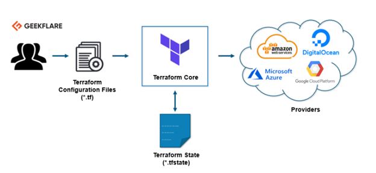

### What is Terraform?

•	Terraform is an open-source infrastructure provisioning tool that is based on “Infrastructure as a Code” paradigm.  
•	Terraform is used to define and provision the complete infrastructure using an easy-to-learn declarative language.  

---

### Features of Terraform (7 points)

1.	With terraform we can store our cloud infrastructure setup as codes.  
a.	It’s very similar to tools such as CloudFormation, which you would use to automate your AWS infrastructure, but you can only use that on AWS.   
b.	With Terraform, you can use it on other cloud platforms as well.  

2.	Terraform is written in Golang and uses own syntax – HCL (Hashicorp Configuration Language), but also supports JSON  
3.	Terraform is a multipurpose composition tool.  
a.	Composes multiple tiers (SaaS/PaaS/IaaS)  
b.	A plugin-based architecture model  

4.	Applies Graph Theory to IaaC and provides Automation, Versioning and Reusability  
5.	Helps to evolve the infrastructure, safely and predictably.  
6.	Designed on immutable infrastructure principles.  
7.	Terraform is a cloud-agnostic tool.   

a.	It embraces all major Cloud Providers and provides common language to orchestrate the infrastructure resources.  

--- 

:::tip
Agnostic, in an information technology (IT) context, refers to something that is generalized so that it is interoperable among various systems.  
:::

---

### Terraform is NOT
•	Terraform is not a configuration management tool like chef, ansible, that exists in the market.

---

### Benefits of using Terraform. (6 points)

1.	Does orchestration, not just configuration management.  
2.	Supports Client only architecture, so no need for additional configuration management on a server.  
3.	Easily portable to any other provider  
4.	Provide immutable infrastructure where configuration changes are done smoothly.  
5.	Uses easy to understand language, HCL (HashiCorp configuration language)  
6.	Supports multiple providers such as AWS, Azure, GCP, DigitalOcean and many more  

---

### Terraform Core concepts.

Below are the core concepts/terminologies used in Terraform:   

•	Provider:  
			Provider is a plugin that is used to interact with the APIs of cloud service provider and access its related resources.  
•	Plan:   
			Plan is one of the stages where terraform determines what needs to be created, updated, or destroyed to move from the current state of the infrastructure to the desired state of the infrastructure.  
•	Apply:   
			Apply is one of the stages where terraform applies the changes to the current state of the infrastructure to move to the desired state.  
•	State:   
			Terraform state consists of cached information about the infrastructure managed by Terraform and its related configurations.  
•	Resources:   
			Resources refers to a block of one or more infrastructure objects which are used in configuring and managing the infrastructure.		
			E.g. compute instances, virtual networks, etc.  
•	Module:   
			Module is a folder with Terraform templates where all the configurations are defined  
•	Variables:     
			Variables are key-value pairs that are used by Terraform modules to allow customization.  
•	Variables are also known as input-variables.  
•	Data Source:   
			Data source is implemented by providers to return information about external objects to terraform.  
•	Output Values:   
			Output Values are the return values of a terraform module that can be used by other configurations.  

1.	Provider  
2.	Plan  
3.	Apply  
4.	State  
5.	Resources  
6.	Module  
7.	Variables  
8.	Data Source  
9.	Output Values  

---

### How Terraform Works?

Terraform has two main components that make up its architecture:  
1.	Terraform Core  
2.	Providers  

#### Terraform Core ####

•	*.tf file.  
o	Terraform configuration file with extension (tf)  
o	Or Desired State  
•	*.tfstate file.	  
o	Terraform state file where terraform keeps the up-to-date state of how the current set up of the infrastructure looks like.  
o	Or Current state of infrastructure.  
•	Terraform core uses the above two input sources to do its job.  
•	The first input source is a Terraform configuration file (*.tf) that we, as a user, configure.  
o	Here, we define what needs to be created or provisioned. (*.tf)  
•	And the second input source is a state(*.tfstate) file where terraform keeps the up-to-date state of how the current set up of the infrastructure looks like.  

•	So, what terraform core does is it takes the input, and it figures out the plan of what needs to be done to achieve the desired state.  
•	It compares the state, what is the current state, and what is the configuration that you desire in the result.  
•	It figures out what needs to be done to get to that desired state as described in the configuration file.  
•	It figures what needs to be created, what needs to be updated, what needs to be deleted to create and provision the infrastructure.  

#### Providers ####

•	The second component of architecture is providers for specific technologies.  
•	Terraform providers (or plugins) provide abstraction above the upstream API and are responsible for understanding API interactions and exposing resources.  
•	
•	 
•	This could be cloud service providers like AWS, Azure, GCP,   
•	It is also a provider for more high-level components like Kubernetes or other platform-as-a-service tools, even some software as a self-service tool.  
•	It gives you the possibility to create infrastructure on different levels.  
o	For example – create an AWS infrastructure, then deploy Kubernetes on top of it and then create services/components inside that Kubernetes cluster.  
•	Terraform has over a hundred providers for different technologies, and each provider then gives terraform user access to its resources.   
•	So, through AWS provider, for example, you have access to hundreds of AWS resources like EC2 instances, the AWS users, etc.   
•	With Kubernetes provider, you access commodities, resources like services and deployments and namespaces, etc.  
So, this is how Terraform works, and this way, it tries to help you provision and cover the complete application setup from infrastructure all the way to the application.  

---

